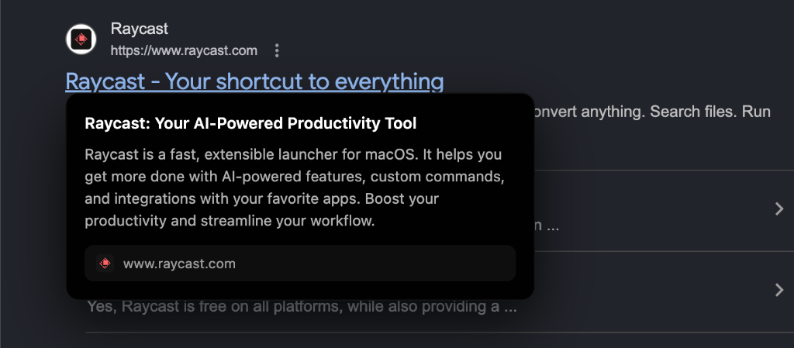

# Arcks - AI Link Previews for Google Search 🚀

**Peek before you click.** Arcks is a browser extension that instantly generates AI-powered preview cards for Google Search results when you hover over them.



## ✨ Features

- **⚡ Instant Previews**: Hover over any Google Search result to see a preview card in ~500ms.
- **🤖 AI-Powered**: Generates a headline + icon bullet-point card using Google Gemini or OpenRouter.
- **☁️ Server-Side Fetching**: Page content is fetched by the Cloudflare Worker — no CORS issues, no client-side scraping.
- **💾 Two-Layer Caching**: KV cache on the worker (30 min) and in-memory cache in the extension (10 min) minimize API calls.
- **🔒 Privacy-First**: No browsing history is stored. Summaries are generated ephemerally.
- **🌑 Dark Card UI**: Solid dark card with a headline and structured bullet points.
- **🎯 Focused**: Lightweight and optimized specifically for Google Search.

## 🛠️ Tech Stack

- **Frontend**: Manifest V3 Chrome Extension (HTML, CSS, JavaScript)
- **Backend Proxy**: Cloudflare Workers with KV caching and rate limiting
- **AI Providers**: Google Gemini 2.5 Flash or any OpenRouter model

## 🔧 Setup & Installation

### 1. Backend Setup (Cloudflare Worker)

1.  **Install dependencies**:
    ```bash
    npm install
    ```
2.  **Deploy the worker**:
    ```bash
    npx wrangler deploy worker.js
    ```
    *Note the URL of your deployed worker (e.g., `https://arcks.yourname.workers.dev`).*

3.  **Set your AI provider API key** — pick one or both:

    **Gemini** (get key from [Google AI Studio](https://makersuite.google.com/app/apikey)):
    ```bash
    npx wrangler secret put GEMINI_API_KEY
    ```

    **OpenRouter** (get key from [openrouter.ai](https://openrouter.ai/keys)):
    ```bash
    npx wrangler secret put OPENROUTER_API_KEY
    ```

4.  **Create a KV namespace** for caching:
    ```bash
    npx wrangler kv namespace create ARCKS_KV
    ```
    Add the binding to `wrangler.toml`, then redeploy.

### 2. Extension Setup

1.  Open Chrome and navigate to `chrome://extensions/`.
2.  Toggle **Developer mode** in the top right.
3.  Click **Load unpacked** and select the `arcks` folder.
4.  **Copy the generated Extension ID** from the card.

### 3. Configuration

1.  **Update Worker Security** — open `worker.js` and replace the placeholder with your Extension ID:
    ```javascript
    const ALLOWED_ORIGINS = [
      'chrome-extension://YOUR_EXTENSION_ID_HERE'
    ];
    ```
    Redeploy: `npx wrangler deploy worker.js`

2.  **Configure the Extension** — open the extension's Options page and set your Worker URL, or edit `background.js` directly:
    ```javascript
    const DEFAULT_SETTINGS = {
      workerUrl: 'https://arcks.yourname.workers.dev',
      hoverDelay: 500,
      enabled: true
    };
    ```

3.  **Reload the extension** in `chrome://extensions/`.

## 📄 License

MIT License © 2025 Rahul
